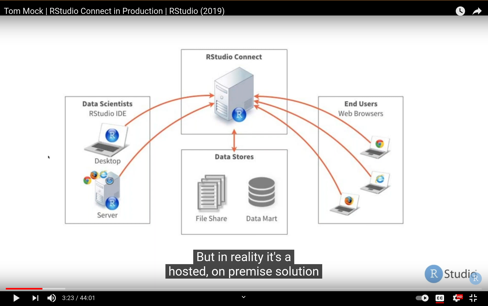
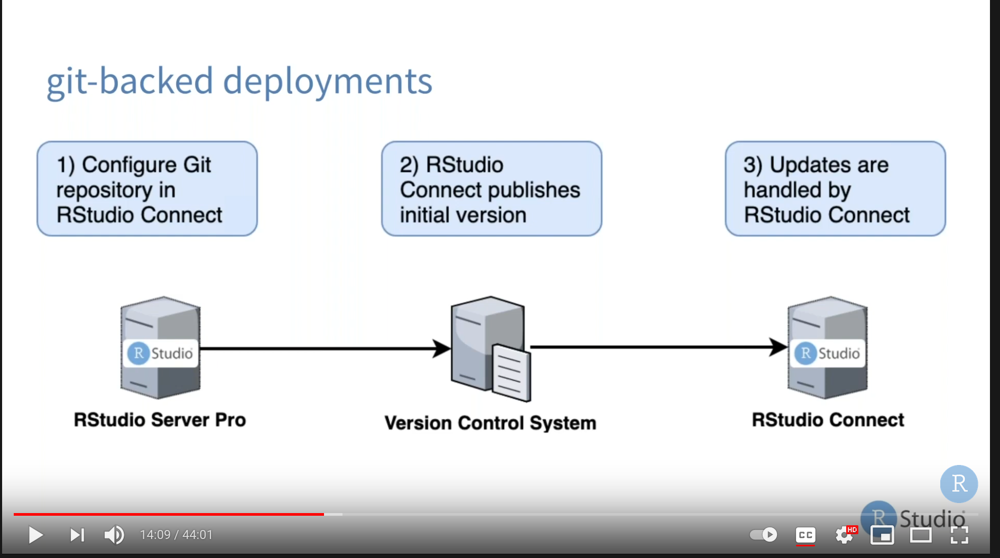
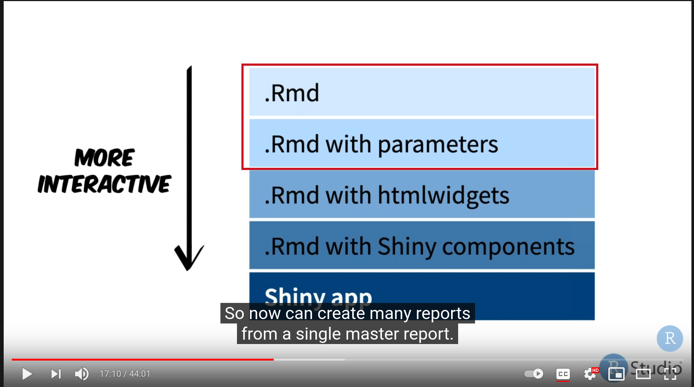
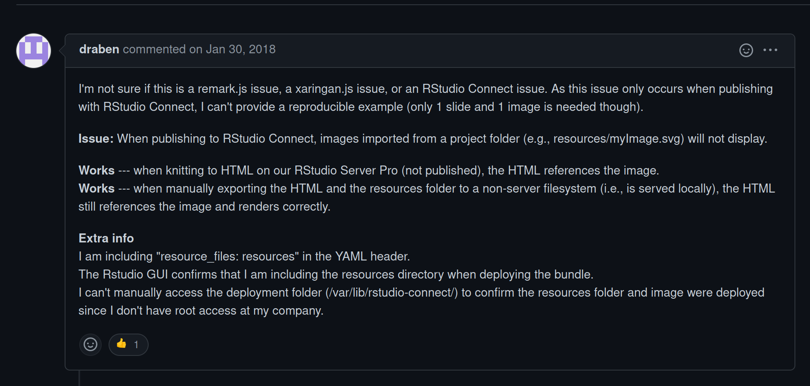

```{r, include=FALSE}
rmarkdown::output_metadata$set(
  rsc_output_files = list.files("images/00", recursive = TRUE, full.names = TRUE)
)
```

```{r xaringan-editable, echo=FALSE}
xaringanExtra::use_editable(expires = 1)
```

# Data access

<style>
.red   { color: red      }
.blue  { color: blue   }
.small { font-size: 70%  }
.remark-slide-content > h1 {
  font-size: 30px;
  margin-top: -15px;
}
</style>



.can-edit[
1. Where does the data reside?
2. How can we give access to local data?
3. Is Connect deployed within UA network?
]

---

# Deployment strategies



.can-edit[
1. Can we deploy from bitbucket or github and if so how?
2. Automatically update the asset on push to the git branch. How to do this?
]
---

# Common use case for us



1. RMD based reports
2. Dashboards
3. Parametrized reports (but very infrequent)

In that order.

---

# Already found this issue with RStudio Connect



[Connect issue with Xaringan presentation figures](https://github.com/yihui/xaringan/issues/106#issue-292804953)

[Workaround described here](https://github.com/yihui/xaringan/issues/106#issuecomment-474921723)

Issue seems to be solved by workaround!

---

Thank you!


